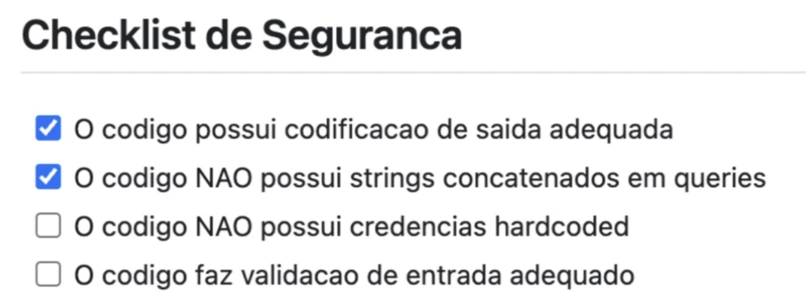

# Autenticação Segura

Não tentar reinventar a roda aqui, usar bibliotecas prontas pela complexidade da tarefa para ser feita corretamente.

## Usar algorítmos de hash de senha fortes e seguros
### Algorítmos fracos
- MD5
- SHA1
- Até o SHA256 já não é tão recomendado.

### Algortímos seguros
- Algorítmo do bcrypt
- Algorítmo do scrypt
- Algorítmo do argon2

## Evitar tokens persistentes demais e cookies inseguros
- Adicionar flags de segurança nos cookies.
- Inserir prazo de vida curto do token, sessão

## MFA sempre que possível

## Proteção contra brute force
Bloqueio dessas tentativas

## Fluxos modernos
- Oauth2
- OpenID Connect

## Gerenciamento de Sessão

## Gestão de Bibliotecas
- Uso de SAST
- Pinagem de versão

## Revisão de Código
Checklist mínimo para revisão segura:
- 

Revisão de código não deve ser caça às bruxas

Também é interessante colocar checklists em PRs, mas traz a dificuldade do desenvolvedor ter de entender sobre os itens do checklist antes de fazer o Pull Request:

